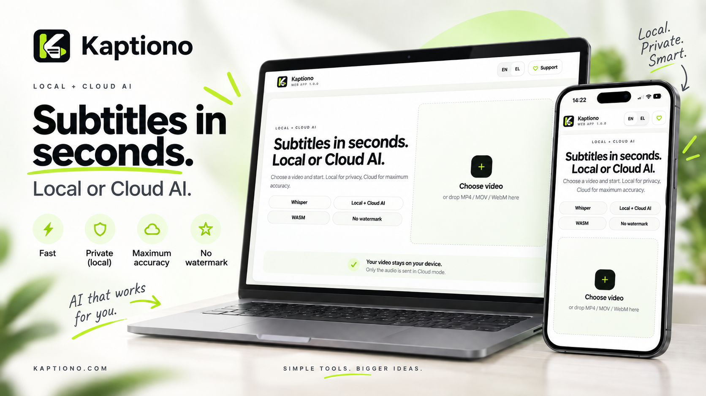

<p align="center">
  <a href="https://kaptiono.com/">
    
  </a>
</p>

<h1 align="center">Kaptiono</h1>

<p align="center">
  <strong>Privacy-first AI subtitles for creators.</strong><br>
  Local Whisper in the browser, optional Cloud High Accuracy, built-in caption editing and no-watermark export.
</p>

<p align="center">
  <a href="https://kaptiono.com/"></a>
  <a href="https://github.com/Donacgreece/Kaptiono/releases/latest"></a>
  <a href="LICENSE"></a>
  
</p>

<p align="center">
  <a href="https://kaptiono.com/"><strong>Open Kaptiono</strong></a>
  &nbsp;·&nbsp;
  <a href="https://kaptiono.com/about/">Product overview</a>
  &nbsp;·&nbsp;
  <a href="https://kaptiono.com/partners/">Partners</a>
  &nbsp;·&nbsp;
  <a href="https://github.com/Donacgreece/Kaptiono/releases">Releases</a>
</p>

---

## Overview

Kaptiono is a browser-based AI subtitle and caption editor designed for creators who want a fast workflow without sending the original video to an application server.

The core product combines:

- Local Whisper transcription in the browser
- Optional Cloud High Accuracy transcription
- Caption editing and live preview
- Creator-focused caption presets and manual styling
- SRT and TXT export
- Burned-in video export
- Social-compatible video export
- Mobile and desktop PWA support
- No mandatory account for the core workflow
- No watermark on exported captions or video

Production application: **https://kaptiono.com/**

Current stable release: **v1.0.0**

## Product showcase

<p align="center">
  <a href="https://kaptiono.com/">
    
  </a>
</p>

The showcase reflects the current Kaptiono v1.0.0 experience across desktop and mobile.

## Processing modes

### Local AI

Local Whisper models run on the user's device. The original video, extracted audio, transcription and editing workflow remain local.

Available local models include:

- Whisper Small, recommended for local quality
- Whisper Base, lighter local option
- Whisper Tiny, fastest local option

### Cloud High Accuracy

Cloud High Accuracy uses Whisper Large v3 Turbo through the Kaptiono Cloud transcription service. Only the extracted audio required for transcription is sent. The original video is not uploaded.

Cloud availability is quota-aware and the application can prevent a transcription from starting when the remaining cloud allowance is insufficient for the selected video.

## Caption Studio

Kaptiono includes a browser-based caption editor with live preview. The current stable build supports controls for:

- Font family, size and weight
- Italic and uppercase styling
- Letter spacing and scale
- Text, highlight, outline and background colors
- Text opacity and outline width
- Horizontal and vertical position
- Caption width and alignment
- Rotation from -90 degrees to +90 degrees
- Words per caption and maximum lines
- Caption speed and segmentation
- Animation, fade timing and word highlight
- Shadow, background box, opacity and padding
- Creator-focused style presets

## Export

Kaptiono supports:

- SRT subtitle export
- TXT transcript export
- Burned-in caption video export
- Social Compatible export for TikTok, Reels and Shorts workflows
- Fast Export for quicker browser-native rendering

Video rendering is performed locally on the device where browser capabilities allow it.

## Privacy model

Kaptiono is designed around a local-first architecture.

### Stays on the device

- Original video
- Local audio extraction
- Caption editing state
- Caption text and timing after transcription
- Video rendering and export
- Local Whisper inference when a Local model is selected

### Cloud High Accuracy

When Cloud High Accuracy is explicitly selected, only extracted audio required for transcription is sent through the Kaptiono Cloud service. The original video is not sent.

Analytics is optional and controlled by consent. It is not intended to receive video, audio, file names, transcript text or caption text.

See the public policies:

- https://kaptiono.com/privacy/
- https://kaptiono.com/cookies/
- https://kaptiono.com/terms/

## Safari and WebKit audio compatibility

Kaptiono uses a layered audio extraction path:

1. Mediabunny / WebCodecs
2. Native Web Audio
3. Lazy LibAV / FFmpeg WebAssembly fallback when browser decoding fails

The LibAV fallback is intended for difficult AAC and ALAC cases on Safari and WebKit. It performs decoding locally and produces the PCM audio required for transcription.

The LibAV / FFmpeg runtime is distributed as a separate third-party component and is not relicensed under the Kaptiono PolyForm license. See:

- `THIRD_PARTY_NOTICES.md`
- `docs/legal/LICENSE_SCOPE.md`
- `docs/legal/THIRD_PARTY_SOURCE_OFFER.md`
- `docs/legal/LIBAV_RUNTIME_REPLACEMENT.md`
- `docs/legal/LEGAL_COMPLIANCE_LIBAV_AUDIO.md`
- `docs/legal/PATENT_NOTICE.md`

## Progressive Web App

Kaptiono can be installed as a PWA on supported browsers and devices.

The stable release includes:

- Standalone PWA operation
- Install-state handling
- iOS Add to Home Screen guidance
- User-visible application update flow
- Update deferral while active work is in progress
- Version-aware service worker caching

## Browser and device targets

Kaptiono targets current modern browsers on:

| Platform | Intended support |
| --- | --- |
| Chrome / Windows | Supported and recommended |
| Edge / Windows | Supported and recommended |
| Chrome / Android | Supported |
| Safari / iPhone and iPad | Supported with compatibility safeguards |
| Safari / macOS | Supported with compatibility safeguards |
| Other modern browsers | Capability-dependent |

Local AI performance depends on device memory, CPU/GPU capabilities, browser support and selected Whisper model.

## Input formats

The application accepts common video formats including:

- MP4
- MOV
- M4V
- WebM

Actual decoding support can vary by browser, operating system and codec availability.

## Technology

Kaptiono is a static browser-first application built with:

- HTML, CSS and JavaScript
- Progressive Web App APIs
- Web Workers
- Whisper / Transformers.js
- ONNX / WebAssembly
- Browser media APIs and Web Audio
- Mediabunny
- LibAV / FFmpeg WebAssembly compatibility fallback
- Cloudflare Workers AI for optional Cloud High Accuracy
- GitHub Pages
- GitHub Actions

## Public site structure

| URL | Purpose |
| --- | --- |
| https://kaptiono.com/ | Production application |
| https://kaptiono.com/about/ | Product overview, features, privacy and FAQ |
| https://kaptiono.com/partners/ | Sponsorship and partnership information |
| https://kaptiono.com/privacy/ | Privacy policy |
| https://kaptiono.com/cookies/ | Cookie policy |
| https://kaptiono.com/terms/ | Terms of use |

The repository also publishes `robots.txt`, `sitemap.xml` and `llms.txt` for discovery and crawler guidance.

## Search and discovery

The production site includes:

- Canonical URLs
- Search-engine crawl directives
- XML sitemap with public production URLs
- Open Graph metadata
- Twitter card metadata
- Structured data for the website, application, organization and relevant page types
- Search Console verification
- `llms.txt`
- Social preview artwork
- Crawlable internal links across product, legal and partnership pages

Sitemap: https://kaptiono.com/sitemap.xml

## Deployment

Production is deployed from the `main` branch through GitHub Actions and GitHub Pages.

```text
main
  -> GitHub Actions validation
  -> LibAV runtime build or restore
  -> GitHub Pages artifact
  -> kaptiono.com
```

The deployment workflow validates the application version, Search Console verification, licensing files and LibAV compatibility artifacts before publishing.

## Release policy

Kaptiono follows semantic versioning for production releases.

- Patch releases: bug fixes and small production corrections
- Minor releases: backward-compatible product improvements
- Major releases: significant product or compatibility changes

A production release should have:

- A committed version in `version.json`
- A Git tag such as `v1.0.0`
- A GitHub Release using the same tag
- A ZIP archive of the release source
- A SHA-256 checksum for the archive
- Release notes in the repository and GitHub Release

Published release tags should be treated as immutable. If code changes after a release tag has been published, the next production release should use a new semantic version instead of moving the existing tag.

See `docs/releases/RELEASE_PROCESS.md` for the release and rollback procedure.

## Rollback

Every production GitHub Release contains an immutable tag and archive. To restore a previous release, check out the required release tag, validate it, and deploy that tagged source.

Example:

```bash
git fetch --tags
git checkout v1.0.0
```

For normal development, return to `main` after inspection or rollback work.

## Repository topics

The repository is intended to be discoverable around AI subtitles, Whisper, local AI, creator tools, PWA and browser-based caption workflows. Repository topics are maintained as part of the release publishing script.

## Repository layout

The repository root is intentionally kept focused on production application files and top-level project metadata. Supporting documentation is grouped under `docs/`, while release tooling lives under `tools/release/`.

```text
.github/                 GitHub workflows, security and contribution guidance
assets/                  Icons, screenshots and social assets
about/                   Product overview page
partners/                Partnership page
privacy/ cookies/ terms/ Public legal pages
docs/                    Deployment, legal and release documentation
tools/                   Build and release tooling
THIRD_PARTY_LICENSES/    Required third-party license texts
index.html               Application entry point
app.js / styles.css      Main application logic and styles
sw.js                    PWA service worker
manifest.webmanifest     PWA manifest
robots.txt / sitemap.xml Search discovery files
llms.txt                 AI/LLM discovery summary
google6ca96312d74da820.html Search Console verification file
```

Files required at the site root, including the Search Console verification file, remain there intentionally.

---

## License

Kaptiono is source available under the **PolyForm Noncommercial License 1.0.0**.

Commercial use is not granted by the public license. A separate commercial arrangement may be available for appropriate use cases.

The public software license does not grant rights to use the Kaptiono name, logo, icon or brand identity for another product or service.

See:

- `LICENSE`
- `docs/legal/TRADEMARKS.md`
- `docs/legal/LICENSE_SCOPE.md`

Kaptiono should be described as source available, not OSI open source.

## Security and responsible reporting

Please do not publish sensitive security issues, private video content, transcripts, credentials or personal data in public issues.

For security-sensitive reports, see `.github/SECURITY.md`.

## Contributing and bug reports

For contribution and testing guidance, see `.github/CONTRIBUTING.md`.

Useful bug reports include:

- Browser and version
- Operating system
- Device model
- Video format and approximate duration
- Selected Whisper model
- Expected behavior
- Actual behavior

Do not attach private video, audio, transcripts or other sensitive user material to a public issue.

## Partnerships and contact

Partnership information: https://kaptiono.com/partners/

General contact: **info@kaptiono.com**

GitHub: https://github.com/Donacgreece/Kaptiono

---

<p align="center">
  <strong>Kaptiono</strong><br>
  Local or Cloud AI subtitles for creators.<br>
  https://kaptiono.com/
</p>
