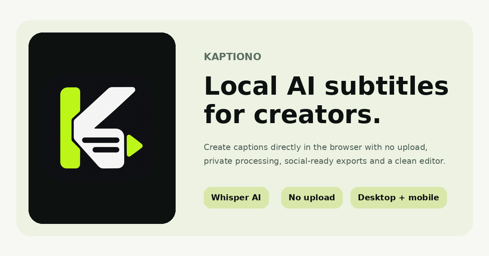

<p align="center">
  
</p>

<h1 align="center">Kaptiono</h1>

<p align="center">
  <strong>Local AI subtitles for creators.</strong><br>
  Generate, style and export captions directly in your browser without uploading your video to a processing server.
</p>

<p align="center">
  <a href="https://kaptiono.com">
    
  </a>
  
  
  
  <a href="LICENSE">
    
  </a>
</p>

<p align="center">
  <a href="https://kaptiono.com">
    
  </a>
</p>

<p align="center">
  <strong>🌐 <a href="https://kaptiono.com">Open Kaptiono</a></strong>
</p>

---

## What is Kaptiono?

**Kaptiono** is a privacy-first captioning tool built for creators, editors and anyone who wants fast subtitles without sending the original video to a cloud transcription service.

The web app runs the main processing workflow on the user's own device. A video is selected locally, audio is extracted in the browser, Whisper generates the transcript, captions can be styled in the Caption Studio, and the result can be exported from the same device.

Kaptiono is designed around a simple idea:

> **Your video should not need to leave your device just to get subtitles.**

The project is currently being developed as a web/PWA experience with a shared product direction for desktop and mobile.

---

## Why Kaptiono?

Most online subtitle tools are built around uploading a video to somebody else's infrastructure. Kaptiono takes a different approach.

| | Kaptiono |
|---|---|
| 🎬 Video processing | Local on the user's device |
| ☁️ Mandatory video upload | **No** |
| 🤖 Speech recognition | Whisper AI |
| 📝 Caption editing | Built-in Caption Studio |
| 🎨 Caption styling | Presets + manual controls |
| 💧 Watermark | **None** |
| 📱 Mobile support | Responsive web app / PWA |
| 💻 Desktop support | Modern desktop browsers |
| 🌍 Interface | Greek + English |
| 💸 Core web experience | Free |

---

## Core features

### 🤖 Local AI transcription

Kaptiono uses **Whisper** models for automatic speech recognition inside the browser.

The current web build includes:

- **Whisper Small** for higher-quality transcription
- Whisper Base as a lighter alternative
- Whisper Tiny for faster testing
- Explicit language selection for better short-form results
- Greek and English workflows
- Word/segment timing used by the caption editor

The goal is to keep inference on the local device whenever the browser environment supports it.

### 🎨 Caption Studio

Captions are not just generated and exported. They can be styled directly in Kaptiono with live preview.

Current controls include:

- Font family
- Font size
- Bold
- Italic
- Uppercase
- Letter spacing
- Scale
- Text color
- Highlight color
- Outline color and width
- Background color
- Text opacity
- Caption position
- Caption width
- Alignment
- Rotation
- Words per caption
- Maximum lines
- Caption speed
- Animation
- Fade timing
- Word-by-word highlight
- Shadow
- Background box
- Box opacity
- Box padding

### ✨ Caption presets

Kaptiono includes creator-focused presets such as:

- Viral Bold
- Creator Yellow
- Clean
- Karaoke
- Podcast
- Gaming
- News
- Minimal

Presets can be used as a starting point and then customized manually.

### 🎥 Live preview

The main video player doubles as the live caption preview.

Changes made in Caption Studio are reflected directly on the video preview, including typography, position, colors, layout and caption flow.

### 📦 Export

Depending on browser capabilities, Kaptiono supports:

- Burned-in caption video export
- MP4 or WebM output where supported by the browser
- SRT subtitle export
- TXT transcript export

Video export is performed locally on the device.

---

## How it works

```text
Local video file
      │
      ▼
Browser media pipeline
      │
      ▼
Local audio extraction
      │
      ▼
Whisper AI transcription
      │
      ▼
Word timestamps + caption segmentation
      │
      ▼
Caption Studio
      │
      ├── Live preview
      ├── Caption styling
      ├── Caption reflow
      └── Manual editing
      │
      ▼
Local export
```

The original video is not sent to a Kaptiono processing backend.

---

## Privacy-first architecture

Privacy is one of the main reasons Kaptiono exists.

### What stays local

The app is designed so that these remain on the user's device:

- Original video
- Extracted audio
- Transcript
- Caption text
- Caption timing
- Rendered/exported video

### What is downloaded from the internet

The browser may download:

- Kaptiono application files
- AI model files
- Required web libraries

### Analytics

Kaptiono uses Google Analytics for anonymous product traffic and usage metrics.

Analytics is **not intended to receive**:

- Video files
- Audio
- File names
- Transcript text
- Caption text

The AI processing workflow remains separate from analytics.

---

## Progressive Web App

Kaptiono can be used as an app-like experience from a supported browser.

### Android

On supported Android browsers, Kaptiono can show the native PWA installation prompt.

Once installed, it can:

- Open from the home screen
- Run in a standalone app window
- Receive application updates from new deployments
- Reuse supported browser caches for application and AI assets

### iPhone / iPad

On iOS, installation is performed through Safari:

1. Open Kaptiono in Safari
2. Tap **Share**
3. Choose **Add to Home Screen**
4. Tap **Add**

Kaptiono includes an in-app guide for this flow.

> Full PWA functionality, service workers and persistent browser caches require HTTPS.

---

## Browser support

Kaptiono targets modern browsers with the media and AI capabilities required for local processing.

| Platform | Status |
|---|---|
| Chrome / Windows | Recommended |
| Edge / Windows | Recommended |
| Chrome / Android | Supported / actively tested |
| Safari / iPhone & iPad | Experimental / actively tested |
| Safari / macOS | Experimental |
| Firefox | Compatibility depends on required browser APIs |

Performance depends heavily on the device, browser, available memory and selected Whisper model.

A high-quality model such as Whisper Small can require significantly more memory and processing time than Base or Tiny.

---

## Input formats

The current web interface accepts common video formats including:

```text
MP4
MOV
M4V
WebM
```

Actual decoding support can vary by browser and device codec support.

---

## Technology

Kaptiono Web is intentionally built as a static, browser-first application.

Current technology includes:

- HTML
- CSS
- JavaScript
- Progressive Web App APIs
- Web Workers
- Whisper / Transformers.js
- ONNX / WASM inference
- Mediabunny
- Web Audio / browser media APIs
- Canvas-based caption rendering
- MediaRecorder / browser-native export where supported
- GitHub Pages
- GitHub Actions

There is **no application server required for the core web captioning workflow**.

---

## Deployment

The web app is deployed as a static site through GitHub Pages.

Production website:

### **[https://kaptiono.com](https://kaptiono.com)**

The repository includes a GitHub Actions workflow that deploys updates from the `main` branch.

```text
git push
   │
   ▼
GitHub Actions
   │
   ▼
GitHub Pages
   │
   ▼
kaptiono.com
```

The PWA includes version-aware update logic so installed clients can move to newer application versions as releases are deployed.

---

## SEO & sharing

Kaptiono includes production-oriented metadata for search engines and social platforms:

- Canonical URL
- Open Graph metadata
- Twitter/X large image card
- Structured data
  - `WebSite`
  - `SoftwareApplication`
  - `FAQPage`
- `robots.txt`
- `sitemap.xml`
- `llms.txt`
- Share thumbnail
- PWA manifest
- Mobile icons
- Apple touch icon

Social/share artwork:

```text
assets/share/kaptiono-og-1200x630.png
```

---

## Project status

Kaptiono Web is under active development.

The focus is currently on making the browser implementation reliable across desktop and mobile before treating it as a fully mature production editor.

Areas being actively improved include:

- Browser compatibility
- iPhone/iPad reliability
- Local AI performance
- Whisper model loading
- Better Greek transcription
- Faster rendering
- MP4 export compatibility
- PWA installation and updates
- Mobile editor ergonomics

---

## Roadmap

Planned directions include:

- ⚡ Faster local transcription
- 🧠 Better quality/performance model selection
- 🎬 More reliable MP4 export
- 📱 Stronger Android and iOS PWA experience
- ✍️ Better caption editing
- 🎨 More caption presets
- 🔤 Additional typography options
- 🧩 Better creator workflows
- 💾 Improved local project persistence
- 🖥️ Continued desktop experience development

Features are added only when they are stable enough for real creator workflows.

---

## License

Kaptiono is **source available** under the **PolyForm Noncommercial License 1.0.0**.

You may use, study, modify and redistribute the software for purposes permitted by that license. **Commercial use is not granted by the public license.** If you want to use Kaptiono or its source code commercially, a separate commercial license may be available.

The software license does **not** grant rights to use the **Kaptiono** name, logo, icon or brand identity for another product or service.

See:

- [`LICENSE`](LICENSE) for the software license notice and official PolyForm terms
- [`TRADEMARKS.md`](TRADEMARKS.md) for the Kaptiono brand policy

Kaptiono should therefore be described as **source available**, not OSI open source.

---

## Support Kaptiono

Kaptiono is being developed with the goal of keeping the core creator experience free.

If the project is useful to you and you would like to support continued development, testing and new features, donations are optional.

<p align="center">
  <a href="https://www.paypal.com/paypalme/DimitrisGalatsanos">
    
  </a>
</p>

---

## Feedback & testing

Kaptiono Web is still evolving, so real-world testing is especially valuable.

Useful reports include:

- Browser and browser version
- Operating system
- Device model
- Video format
- Approximate video duration
- Whisper model selected
- What happened
- What you expected to happen

Please do **not** include private video content, transcripts or other sensitive material in public bug reports.

---

## Philosophy

Kaptiono is being built around four principles:

**Local. Private. Simple. Creator-first.**

No mandatory upload.  
No mandatory account for the core workflow.  
No watermark.  
No unnecessary complexity.

---

<p align="center">
  <strong>Kaptiono</strong><br>
  Local AI subtitles for creators.<br><br>
  <a href="https://kaptiono.com">kaptiono.com</a>
</p>
